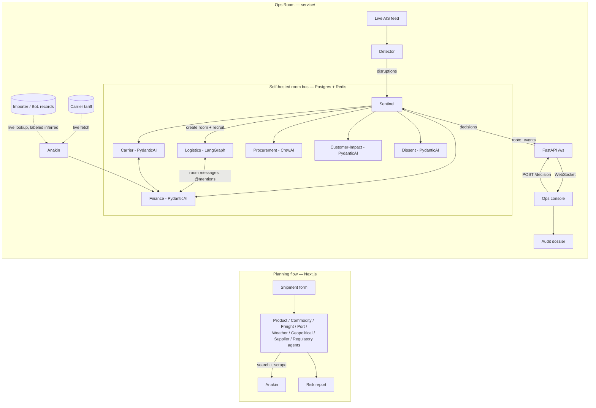

# The All Freight

**Plan a shipment before it moves. Watch it — and act — once it does.**

The All Freight is a two-part supply-chain intelligence platform built on [Anakin](https://anakin.io) as its live-web layer:

1. **Plan** — describe a shipment (product, origin, destination, weight, ship date) and a fleet of AI agents researches live freight rates, tariffs, port congestion, weather, and geopolitical risk to return a single actionable risk score, cost/delay forecast, and recommended actions.
2. **Ops Room** — a Sentinel agent watches a live AIS vessel feed for real disruptions (a ship stuck at anchor, an ETA slip). It opens a room, recruits a swarm of agents across three frameworks who negotiate a recovery option with real demurrage-cost exposure, a quorum vote and an adversarial dissent step produce one recommendation, and a human approves or rejects it — leaving a one-page audit dossier behind.

Anakin is what makes both halves *live*: it's the web-search/scrape layer behind the planning flow, and it's what lets the Ops Room fetch real carrier tariff data and importer/bill-of-lading records from the open web instead of relying on manually-downloaded CSVs.

**Live**: [the-all-freight.vercel.app](https://the-all-freight.vercel.app) (planning flow + `/ops` console) · backend at `https://136-119-139-202.nip.io`.

---

## Architecture



The room bus is a deliberate simplification: rather than a hosted coordination service, room state is just a Postgres table (`RoomMessage`) plus a Redis pub/sub channel. Each agent process subscribes and only reacts to messages that `@mention` its role — the negotiation, the quorum vote, and the audit trail all work the same way, with one fewer external dependency.

## No fabricated data

Every number in the Ops Room is either live (AIS positions) or cited (Maersk's published tariff, U.S. Customs bills of lading). When a live BoL/importer lookup can't be confirmed against a primary source, it's labeled `inferred` rather than presented as fact. When no tariff row matches, the cost is reported as unavailable rather than guessed.

## Project structure

```text
src/                     Next.js app — planning flow (/) and ops console (/ops)
  lib/anakin.ts          Anakin search + scrape client (with mock fallback, no key needed to demo)
  lib/agents.ts          Product, commodity, freight, port, weather, geopolitical, supplier, regulatory agents
  app/ops/               Ops console: vessel map, live room feed, options, approve/reject, dossier link

service/                 Python system — Ops Room backend + agent swarm
  backend/               FastAPI, AIS detector, cost/tariff engine, dossier, event relay
  backend/anakin_client.py, tariff_fetcher.py, bol_live_lookup.py   Anakin integrations
  agents/room_bus/       Self-hosted room bus (Postgres + Redis)
  agents/{sentinel,logistics,carrier,finance,customer_impact,dissent,procurement}/
```

## Development setup

**Planning flow** (Node 20+):

```bash
npm install
cp .env.example .env.local   # add ANAKIN_API_KEY and point NEXT_PUBLIC_API_URL at a running backend
npm run dev                  # http://localhost:3000
```

Runs end-to-end with no keys at all, using a built-in mock dataset for the web-search layer — add `ANAKIN_API_KEY` for live web intelligence. Agent reasoning is proxied through the ops-room backend's `/llm/complete` (Vertex AI) — no GCP credentials needed in this app itself, but a backend needs to be running (see below) for real (non-fallback) reasoning.

**Ops Room** (Python 3.12+, [uv](https://docs.astral.sh/uv/); local Postgres + Redis via Docker by default):

```bash
cd service
docker compose up -d   # local Postgres + Redis
cp .env.example .env   # DATABASE_URL/REDIS_URL already point at the containers above;
                        # add AISSTREAM_API_KEY, GCP_PROJECT_ID, K2THINK_API_KEY, ANAKIN_API_KEY, ...
uv sync
(cd backend && uv run alembic upgrade head)
make run-backend        # FastAPI on :8000
make run-detector        # AIS disruption detector, separate shell
make run-agents          # all 7 agents, separate shell (or `make run-all` with overmind/honcho/foreman)
```

Trigger a demo disruption from a captured AIS window (from inside `service/`): `python backend/replay.py data/captures/<port>_<date>.jsonl --speed 20`, or `POST /demo/replay {"file_path": "..."}`.

Live-fetch the carrier tariff via Anakin at any time: `POST /admin/tariffs/refresh` (or the "Refresh live tariff" button in the ops console).

## Environment variables

Root `.env.local`: `NEXT_PUBLIC_API_URL`, `NEXT_PUBLIC_WS_URL`, `ANAKIN_API_KEY`. No GCP credentials of any kind — the Vertex AI call happens server-side in the backend, not in this app.

`service/.env`: `DATABASE_URL` (Supabase in production, local Docker Postgres for dev), `REDIS_URL`, `AISSTREAM_API_KEY`, `GCP_PROJECT_ID`, `GCP_LOCATION`, `K2THINK_API_KEY`, `FEATHERLESS_KEY`, `ANAKIN_API_KEY`.

## Deployment

Frontend on Vercel; backend + all 7 agents on a single GCE VM (systemd services, local Redis, Supabase Postgres) — see `CLAUDE.md`'s "Deployment" section for the exact setup and redeploy steps, and `.agent/records/production-deployment.md` for why it's shaped this way.

## Tech stack

Next.js · React · TypeScript · Tailwind CSS · MapLibre GL · Recharts · Vertex AI (Gemini) · K2 Think · **Anakin** · FastAPI · Supabase (Postgres) · Redis · Docker · LangGraph · PydanticAI · CrewAI · Google Cloud · Vercel.

## Documentation

Architectural decisions are recorded as ADRs in [`.agent/records/`](.agent/records/); `CLAUDE.md` at the repo root tracks the current architecture, integration points, and environment variables with per-section audit dates.

## License

MIT
